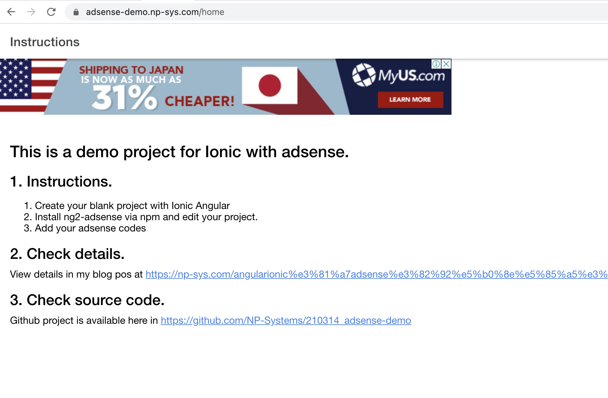

## Overview

This is a Ionic(Angular) demo project to show how adsense can be integrated with Ionic Angular. 

How to integrate
- Create your blank project with Ionic Angular.</li>
- Install ng2-adsense via npm.</li>
- Edit your project. Note that you need to add extra codes not mentioned in ng2-adsense page.</li>

## Demo site
A demo site is available at here. 

[https://adsense-demo.np-sys.com](https://adsense-demo.np-sys.com)

## Instructions

Details is available at my blog post.

[https://np-sys.com/integrate-adsense-in-ionic-angular/](https://np-sys.com/integrate-adsense-in-ionic-angular/)

